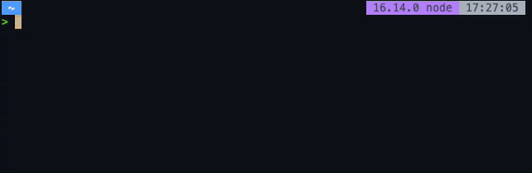

# JoseXS

¡Hola! soy un desarrollador full-stack de Madrid (España). Dedicado a esto del desarrollo desde 2016, he sido autodidacta en cuanto a mi formacion, aunque anteriormente me dedicaba a la rama de sistemas.

Puedes ver mi nueva pagina web en [josexs.github.io](https://josexs.github.io/)

## ¿Con que estoy ahora?
A nivel personal me encuentro con el desarrollo de CarsTournaments, una APP hibrida, asi como su parte backend y admin.

Actualmente esta liberado el repositorio del backend, por si quereis investigar, en breves se liberaran tanto el de admin como el de app

Podeis ver mas en [CarsTournaments.com](https://carstournaments.com)

## Skills

### Lenguajes

        

### Frameworks

      

### Bases de datos

 

### Varios



### Ultimas publicaciones
<!-- BLOG-POST-LIST:START -->
- [Translate with alias](https://dev.to/josexs/translate-with-alias-2m9k)
- [Scraping maps.race](https://dev.to/josexs/scraping-race-7o3)
- [Mis utilidades en MacOS](https://dev.to/josexs/mis-utilidades-en-macos-4j6h)
- [Prettier y Husky](https://dev.to/josexs/prettier-y-husky-1od)
<!-- BLOG-POST-LIST:END -->

### Mas informacion

<!--START_SECTION:waka-->


**🐱 Mis datos de GitHub** 

> 🏆 861 Contribuciones durante el año 2022
 > 
> 📦 465.3 kB Almacenamiento de GitHub utilizado 
 > 
> 💼 Abierto a contratación
 > 
> 📜 9 Repositorios Públicos 
 > 
> 🔑 22 Repositorios Privados  
 > 
**Soy diurno 🐤** 

```text
🌞 Mañana     108 commits    ⬛⬛⬛⬛⬜⬜⬜⬜⬜⬜⬜⬜⬜⬜⬜⬜⬜⬜⬜⬜⬜⬜⬜⬜⬜   17.01% 
🌆 Día        248 commits    ⬛⬛⬛⬛⬛⬛⬛⬛⬛⬜⬜⬜⬜⬜⬜⬜⬜⬜⬜⬜⬜⬜⬜⬜⬜   39.06% 
🌃 Tarde      236 commits    ⬛⬛⬛⬛⬛⬛⬛⬛⬛⬜⬜⬜⬜⬜⬜⬜⬜⬜⬜⬜⬜⬜⬜⬜⬜   37.17% 
🌙 Noche      43 commits     ⬛⬜⬜⬜⬜⬜⬜⬜⬜⬜⬜⬜⬜⬜⬜⬜⬜⬜⬜⬜⬜⬜⬜⬜⬜   6.77%

```
📅 **Soy más productivo los Domingo** 

```text
Lunes        53 commits     ⬛⬛⬜⬜⬜⬜⬜⬜⬜⬜⬜⬜⬜⬜⬜⬜⬜⬜⬜⬜⬜⬜⬜⬜⬜   8.35% 
Martes       92 commits     ⬛⬛⬛⬜⬜⬜⬜⬜⬜⬜⬜⬜⬜⬜⬜⬜⬜⬜⬜⬜⬜⬜⬜⬜⬜   14.49% 
Miércoles    109 commits    ⬛⬛⬛⬛⬜⬜⬜⬜⬜⬜⬜⬜⬜⬜⬜⬜⬜⬜⬜⬜⬜⬜⬜⬜⬜   17.17% 
Jueves       52 commits     ⬛⬛⬜⬜⬜⬜⬜⬜⬜⬜⬜⬜⬜⬜⬜⬜⬜⬜⬜⬜⬜⬜⬜⬜⬜   8.19% 
Viernes      70 commits     ⬛⬛⬜⬜⬜⬜⬜⬜⬜⬜⬜⬜⬜⬜⬜⬜⬜⬜⬜⬜⬜⬜⬜⬜⬜   11.02% 
Sábado       129 commits    ⬛⬛⬛⬛⬛⬜⬜⬜⬜⬜⬜⬜⬜⬜⬜⬜⬜⬜⬜⬜⬜⬜⬜⬜⬜   20.31% 
Domingo      130 commits    ⬛⬛⬛⬛⬛⬜⬜⬜⬜⬜⬜⬜⬜⬜⬜⬜⬜⬜⬜⬜⬜⬜⬜⬜⬜   20.47%

```


📊 **Esta semana me dediqué a** 

```text
💬 Lenguajes: 
TypeScript               11 hrs 31 mins      ⬛⬛⬛⬛⬛⬛⬛⬛⬜⬜⬜⬜⬜⬜⬜⬜⬜⬜⬜⬜⬜⬜⬜⬜⬜   31.87% 
Other                    7 hrs 28 mins       ⬛⬛⬛⬛⬛⬜⬜⬜⬜⬜⬜⬜⬜⬜⬜⬜⬜⬜⬜⬜⬜⬜⬜⬜⬜   20.68% 
HTML                     5 hrs 25 mins       ⬛⬛⬛⬜⬜⬜⬜⬜⬜⬜⬜⬜⬜⬜⬜⬜⬜⬜⬜⬜⬜⬜⬜⬜⬜   15.0% 
Python                   3 hrs 54 mins       ⬛⬛⬜⬜⬜⬜⬜⬜⬜⬜⬜⬜⬜⬜⬜⬜⬜⬜⬜⬜⬜⬜⬜⬜⬜   10.8% 
Markdown                 1 hr 43 mins        ⬛⬜⬜⬜⬜⬜⬜⬜⬜⬜⬜⬜⬜⬜⬜⬜⬜⬜⬜⬜⬜⬜⬜⬜⬜   4.77%

🔥 Editores: 
VS Code                  27 hrs 45 mins      ⬛⬛⬛⬛⬛⬛⬛⬛⬛⬛⬛⬛⬛⬛⬛⬛⬛⬛⬛⬜⬜⬜⬜⬜⬜   76.76% 
Zsh                      8 hrs 23 mins       ⬛⬛⬛⬛⬛⬜⬜⬜⬜⬜⬜⬜⬜⬜⬜⬜⬜⬜⬜⬜⬜⬜⬜⬜⬜   23.21% 
Android Studio           0 secs              ⬜⬜⬜⬜⬜⬜⬜⬜⬜⬜⬜⬜⬜⬜⬜⬜⬜⬜⬜⬜⬜⬜⬜⬜⬜   0.04%

```

**Programo principalmente en TypeScript** 

```text
TypeScript               13 repos            ⬛⬛⬛⬛⬛⬛⬛⬛⬛⬛⬛⬜⬜⬜⬜⬜⬜⬜⬜⬜⬜⬜⬜⬜⬜   44.83% 
JavaScript               5 repos             ⬛⬛⬛⬛⬜⬜⬜⬜⬜⬜⬜⬜⬜⬜⬜⬜⬜⬜⬜⬜⬜⬜⬜⬜⬜   17.24% 
Shell                    4 repos             ⬛⬛⬛⬜⬜⬜⬜⬜⬜⬜⬜⬜⬜⬜⬜⬜⬜⬜⬜⬜⬜⬜⬜⬜⬜   13.79% 
Python                   4 repos             ⬛⬛⬛⬜⬜⬜⬜⬜⬜⬜⬜⬜⬜⬜⬜⬜⬜⬜⬜⬜⬜⬜⬜⬜⬜   13.79% 
Dart                     1 repo              ⬜⬜⬜⬜⬜⬜⬜⬜⬜⬜⬜⬜⬜⬜⬜⬜⬜⬜⬜⬜⬜⬜⬜⬜⬜   3.45%

```


 Last Updated on 23/09/2022 01:03:21 UTC
<!--END_SECTION:waka-->


