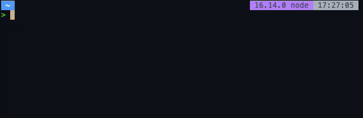
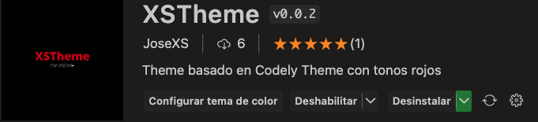

# JoseXS

¡Hola! soy un desarrollador full-stack de Madrid (España). Dedicado al desarrollo desde 2016, he sido autodidacta en cuanto a mi formacion, aunque anteriormente me dedicaba a la rama de sistemas.

Puedes ver mi nueva pagina web en [josexs.github.io](https://josexs.github.io/)

## ¿Con que estoy ahora?
A nivel personal me encuentro con el desarrollo de **XSMusic**, un proyecto que consta de 3 aplicaciones (API, APP, ADMIN). El frontal desarrollado en Angular y el backend con Python (FastApi)

## Skills

### Lenguajes

        

### Frameworks

      

### Bases de datos

 

### Varios
#### Paquete NodeJS josexs

[](https://www.npmjs.com/package/josexs)

#### Diseño VS Code dark con tonos rojos

[](https://marketplace.visualstudio.com/items?itemName=JoseXS.xstheme)

### Ultimas publicaciones
<!-- BLOG-POST-LIST:START -->
- [Translate with alias](https://dev.to/josexs/translate-with-alias-2m9k)
- [Scraping maps.race](https://dev.to/josexs/scraping-race-7o3)
- [Mis utilidades en MacOS](https://dev.to/josexs/mis-utilidades-en-macos-4j6h)
- [Prettier y Husky](https://dev.to/josexs/prettier-y-husky-1od)
<!-- BLOG-POST-LIST:END -->

### Mas informacion

<!--START_SECTION:waka-->


**🐱 Mis datos de GitHub** 

> 📦 105.9 kB Almacenamiento de GitHub utilizado 
 > 
> 🏆 2,298 Contribuciones durante el año 2025
 > 
> 💼 Abierto a contratación
 > 
> 📜 11 Repositorios Públicos 
 > 
> 🔑 14 Repositorios Privados 
 > 
**Soy nocturno 🦉** 

```text
🌞 Mañana                 2114 commits        ⬛⬛⬛⬜⬜⬜⬜⬜⬜⬜⬜⬜⬜⬜⬜⬜⬜⬜⬜⬜⬜⬜⬜⬜⬜   13.55 % 
🌆 Día                    5684 commits        ⬛⬛⬛⬛⬛⬛⬛⬛⬛⬜⬜⬜⬜⬜⬜⬜⬜⬜⬜⬜⬜⬜⬜⬜⬜   36.42 % 
🌃 Tarde                  6264 commits        ⬛⬛⬛⬛⬛⬛⬛⬛⬛⬛⬜⬜⬜⬜⬜⬜⬜⬜⬜⬜⬜⬜⬜⬜⬜   40.14 % 
🌙 Noche                  1544 commits        ⬛⬛⬜⬜⬜⬜⬜⬜⬜⬜⬜⬜⬜⬜⬜⬜⬜⬜⬜⬜⬜⬜⬜⬜⬜   09.89 % 
```
📅 **Soy más productivo los Sábado** 

```text
Lunes                    2014 commits        ⬛⬛⬛⬜⬜⬜⬜⬜⬜⬜⬜⬜⬜⬜⬜⬜⬜⬜⬜⬜⬜⬜⬜⬜⬜   12.91 % 
Martes                   2240 commits        ⬛⬛⬛⬛⬜⬜⬜⬜⬜⬜⬜⬜⬜⬜⬜⬜⬜⬜⬜⬜⬜⬜⬜⬜⬜   14.35 % 
Miércoles                1871 commits        ⬛⬛⬛⬜⬜⬜⬜⬜⬜⬜⬜⬜⬜⬜⬜⬜⬜⬜⬜⬜⬜⬜⬜⬜⬜   11.99 % 
Jueves                   1952 commits        ⬛⬛⬛⬜⬜⬜⬜⬜⬜⬜⬜⬜⬜⬜⬜⬜⬜⬜⬜⬜⬜⬜⬜⬜⬜   12.51 % 
Viernes                  2226 commits        ⬛⬛⬛⬛⬜⬜⬜⬜⬜⬜⬜⬜⬜⬜⬜⬜⬜⬜⬜⬜⬜⬜⬜⬜⬜   14.26 % 
Sábado                   2852 commits        ⬛⬛⬛⬛⬛⬜⬜⬜⬜⬜⬜⬜⬜⬜⬜⬜⬜⬜⬜⬜⬜⬜⬜⬜⬜   18.28 % 
Domingo                  2451 commits        ⬛⬛⬛⬛⬜⬜⬜⬜⬜⬜⬜⬜⬜⬜⬜⬜⬜⬜⬜⬜⬜⬜⬜⬜⬜   15.71 % 
```


📊 **Esta semana me dediqué a** 

```text
💬 Lenguajes: 
Sin actividad registrada esta semana

🔥 Editores: 
Sin actividad registrada esta semana
```

**Programo principalmente en TypeScript** 

```text
TypeScript               9 repos             ⬛⬛⬛⬛⬛⬛⬛⬛⬛⬜⬜⬜⬜⬜⬜⬜⬜⬜⬜⬜⬜⬜⬜⬜⬜   37.50 % 
JavaScript               6 repos             ⬛⬛⬛⬛⬛⬛⬜⬜⬜⬜⬜⬜⬜⬜⬜⬜⬜⬜⬜⬜⬜⬜⬜⬜⬜   25.00 % 
Python                   4 repos             ⬛⬛⬛⬛⬜⬜⬜⬜⬜⬜⬜⬜⬜⬜⬜⬜⬜⬜⬜⬜⬜⬜⬜⬜⬜   16.67 % 
Markdown                 1 repo              ⬛⬜⬜⬜⬜⬜⬜⬜⬜⬜⬜⬜⬜⬜⬜⬜⬜⬜⬜⬜⬜⬜⬜⬜⬜   04.17 % 
CSS                      1 repo              ⬛⬜⬜⬜⬜⬜⬜⬜⬜⬜⬜⬜⬜⬜⬜⬜⬜⬜⬜⬜⬜⬜⬜⬜⬜   04.17 % 
```


 Last Updated on 14/11/2025 00:11:43 UTC
<!--END_SECTION:waka-->


